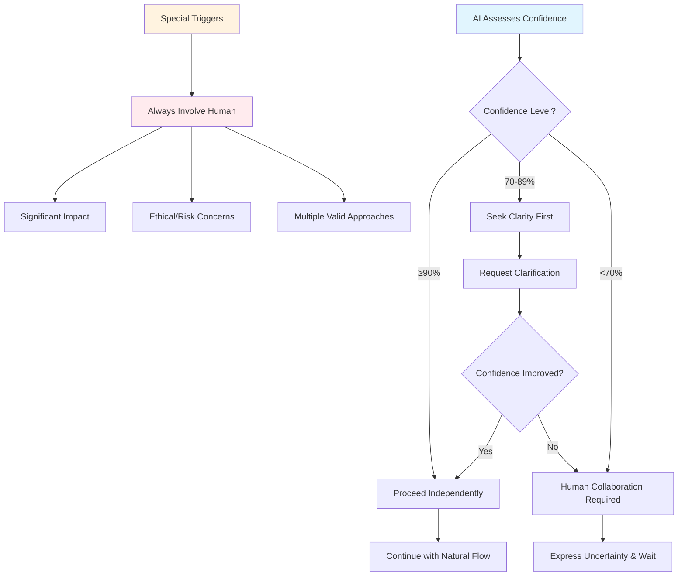

# AI (Aaditri Informatics) Framework

There's an Experimental branch if you want to test and give feedback.

## Installation

The framework uses a **prompt injection method** through the `00-rules.md` file, which contains collaboration rules that modify AI behavior:

```bash
# Place 00-rules.md in your AI assistant's rules directory:

1. For Roo Code: .roo/rules/
2. For Cline: .clinerules/
3. For Cursor: .cursor/rules/
4. For Claude: rename 00-rules.md to claude.md
```

# Human-AI Collaboration Framework

## Vision

This framework establishes a systematic approach to human-AI collaboration that prioritizes thoughtful problem-solving partnerships over simple solution generation. By implementing confidence-based interaction patterns, natural communication flow, and quality assurance mechanisms, it enables productive collaboration that leverages both human insight and AI capabilities.

## Core Philosophy

### Collaborative Problem-Solving
- **Human-in-the-loop**: AI operates as a thoughtful partner, not an autonomous solution generator
- **Confidence-based interaction**: Collaboration level determined by AI confidence assessment
- **Iterative refinement**: Solutions evolve through feedback cycles and validation checkpoints
- **Context preservation**: Decisions, rationale, and learning are systematically captured

### Quality Through Process
- **Transparency**: AI shows confidence levels and thinking process explicitly
- **Validation**: Multiple checkpoints ensure alignment and quality
- **Adaptability**: Framework adapts to different problem domains and complexity levels
- **Learning**: Both human and AI improve through documented iterations

## Architectural Principles

### 1. Confidence-Based Human Interaction

The framework implements a confidence-driven collaboration process:



### 2. Injected Enhancement Architecture

The framework operates as a **behavioral enhancement layer** that injects on top of existing agentic tools:

#### Role Boundaries
- **Enhances collaboration patterns** without overriding core tool functionality
- **Focuses on when/how to involve humans** rather than tool usage directives
- **Works with any agentic tool's existing system prompt** and capabilities
- **Provides collaboration guidance** as an overlay enhancement

#### Confidence-Based Triggers

Intelligent interaction patterns based on AI confidence assessment:
- **≥90% Confidence:** Proceed independently with collaborative communication
- **70-89% Confidence:** Proactively Seek Clarity
- **<70% Confidence:** Human collaboration required before proceeding

#### Enhanced Confidence Assessment
The framework includes reasoning quality validation to improve confidence accuracy:
- **Reasoning completeness:** Self-assessment of comprehensive analysis
- **Logic consistency:** Validation of reasoning step soundness
- **Assumption clarity:** Verification that assumptions are explicitly stated

#### Special Triggers (Regardless of Confidence)
- **Significant Impact:** Highlight areas affected and confirm before proceeding
- **Ethical/Risk Concerns:** Flag risks with suggested mitigation
- **Multiple Valid Approaches:** Present options with recommendations

### 3. Natural Communication Flow

#### Confidence Indicators
Confidence levels integrated naturally into response flow, avoiding mechanical formatting

#### Communication Patterns
- **Natural language flow** throughout all interactions
- **Avoid rigid format requirements** that create overhead
- **Clear reasoning** with appropriate level of detail
- **Responsive feedback integration** and context building

### 4. Context Management System

#### Session-Level Context
```
Problem: [brief description]
Requirements: [key requirements]
Decisions: [key decisions with rationale]
Status: [completed/remaining/blockers]
```

#### Project-Level Context
Cross-session context preservation enabling learning accumulation and decision continuity across project lifecycle.

#### Knowledge Preservation
Systematic capture and reuse of collaboration patterns, decisions, and lessons learned for continuous improvement.

### 5. Quality Assurance Framework

#### Three-Layer Validation

**Layer 1: Pre-Development**
- [ ] Requirements clearly understood
- [ ] Approach validated with human
- [ ] Potential issues identified
- [ ] Success criteria defined

**Layer 2: During Development**
- [ ] Regular check-ins with human
- [ ] Quality standards maintained
- [ ] Edge cases considered
- [ ] Limitations acknowledged

**Layer 3: Post-Development**
- [ ] Human approval received
- [ ] Solution reviewed for completeness
- [ ] Validation approach defined
- [ ] Documentation updated

## Directory Structure

The framework supports systematic organization of collaboration artifacts:

```
/
├── README.md                    # This framework documentation
├── context/                     # Collaboration context and artifacts
│   ├── INDEX.md                # Context management guidelines
│   ├── docs/                   # Framework documentation
│   ├── workflows/              # Standard workflow definitions
│   ├── [PROJECT_NAME]/         # Project-specific collaboration context
│   │   ├── architecture.md     # Technical architecture decisions
│   │   ├── prd.md              # Product Requirements Document
│   │   ├── INDEX.md            # Project collaboration overview
│   │   ├── TODO.md             # Project task tracking
│   │   └── journal/            # Session-by-session collaboration log
│   │       ├── [YYYY-MM-DD]/   # Daily collaboration sessions
│   │       │   ├── [HHMM]-[TASK_NAME].md  # Individual session records
├── [PROJECT_NAME]/             # Actual project files and deliverables
│   ├── README.md               # Project documentation
│   └── (other project folders/files)  # Project-specific files and folders
```

## Framework Evolution

This collaboration framework is designed to evolve based on:
- Practical experience and usage patterns
- Effectiveness metrics and user feedback
- Domain-specific requirements and adaptations
- Technological capabilities and limitations
- Community contributions and improvements

Framework improvements and contributions should align with the core philosophy of thoughtful, collaborative problem-solving while respecting role boundaries as an injected enhancement layer.

---

*This framework emphasizes collaborative problem-solving through intelligent confidence-based interaction patterns. It enhances agentic tools without overriding their core functionality, creating natural human-AI partnerships focused on quality outcomes.*
